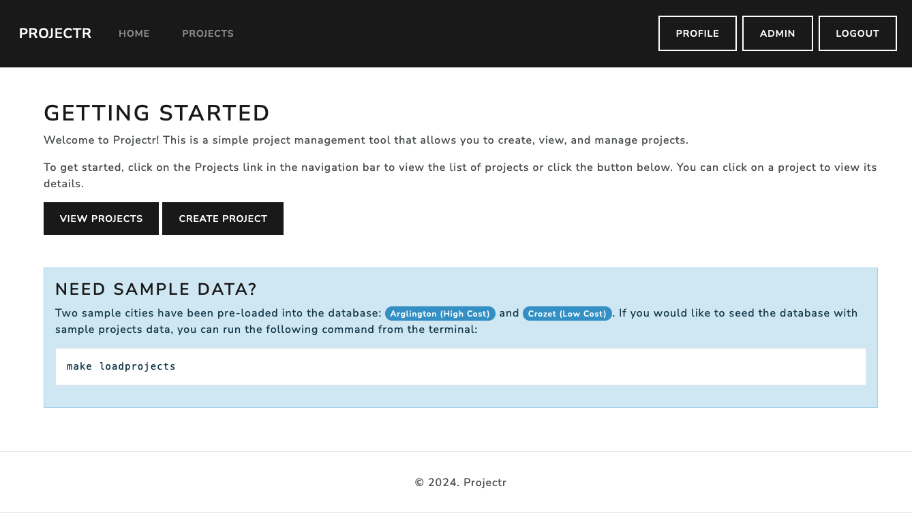
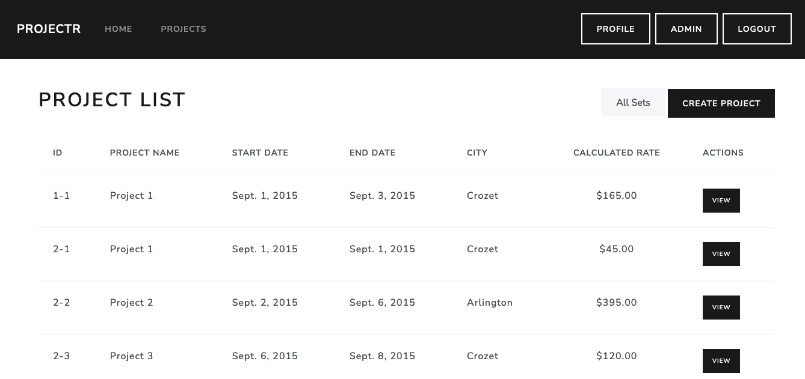
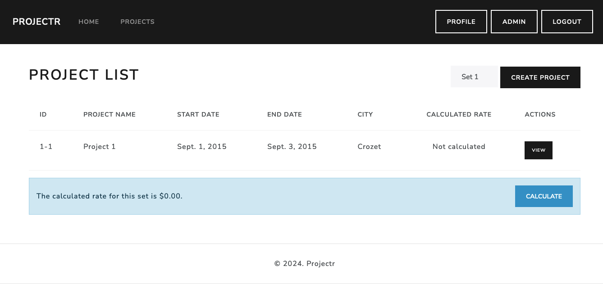

# Projectr - Sample Project Reimbursement Application

This application is intended to satisfy the requirements for SimpleThread's sample application to calculate reimbursements for projects.

## Getting Started

This application uses Poetry for Python package management. To install the application run:


### Step 1: Install the application
```bash
# Start the Poetry shell
make shell

# Install the application dependencies
make install
```

### Step 2: Initialize the application
Once the environment has been configured, you'll want to run:
```bash
make init
```

This command will:
- Setup the database
- Create a local `.env`* file.
    > Note: Edit the `.env` file to update the `SECRET_KEY` value to ensure that your application uses a unique secret key.
- Create two demo user accounts:
    - Admin User:
        - Username: `admin`
        - Password: `password`
        - Email: `demo+admin@example.com`
    - Regular User:
        - Username: `user`
        - Password: `password`
        - Email: `demo+user@example.com`
- Create two sample cities.
    - `Arlington` (high-cost city)
    - `Crozet` (low-cost city)


### Step 3: Running the application
To start the application server in development (debug) mode, run:
```bash
make debug
```
> Note: This will start the Werkzeug application server which provides a more friendly development experience for debugging.

Once the application is running, navigate to http://localhost:8000/. You should see the following screen.



The `View Projects` button will navigate to the Projects List View, which contains a list of all projects in the database.



Project sets can be filtered by selecting the desired project set value from the dropdown next to the `Create Project` button.



Click the `Calcuate` button to calculate the reimbursement rates for the projects in the currently selected project set.


#### Reimbursement Rules

The following rules apply for calculating the reimbursement rates.

- Travel Day Rates:
    - $45 per day in a Low-Cost City.
    - $55 per day in a High-Cost City.
- Full Day Rates:
    - $75 per day in a Low-Cost City.
    - $85 per day in a High-Cost City.
- Day Types:
    - Travel Day: The first and last day of a project, or a project sequence, is always considered a travel day.
    - Full Day: Any day in the middle of a project or sequence of projects is considered a full day.
    - Gap Handling: If there is a gap between projects, the days before and after the gap are treated as travel days.
    - Overlap: If two projects overlap or touch each other, the shared days are treated as full days.
    - Day Deduplication: Each day is counted once, even if multiple projects overlap on that day.

## Data Models

### City
- `name`: The name of the city.
- `state`: The state abbreviation.
- `cost_type`: Indicates whether the city is high-cost or low-cost.

### Project
- `set`: The project set number.
- `idx`: The project index within the set.
- `name`: The name of the project.
- `start_date`: The start date of the project.
- `end_date`: The end date of the project.
- `city`: The city where the project is located.

## Sample Data

A sample data file, `projects_fixtures.json`, has been included. To load the sample data into the application, run the following command:

```bash
make loadprojects
```

This will populate the application with sample projects to allow testing reimbursement calculations.

## What's Next?

This application was developed to demonstrate core functionality within a limited time frame. For production use, the following features could be added:

- UI/UX: Enhance the interface by refining form validation, styling, and mobile responsiveness. The current interface uses Bootstrap with a Bootswatch theme for rapid prototyping.
- Test coverage: Expand test coverage with unit tests for reimbursement calculations, data validation, and user authentication flows using Django's testing framework.
- AuthZ/AuthN:  Fully implement authentication and user management features with django-allauth, supporting OAuth2 providers and role-based access.
- Email Notifications: Integrate an email service (e.g., SendGrid or Amazon SES) to handle notifications for events, such as reimbursement submissions.
